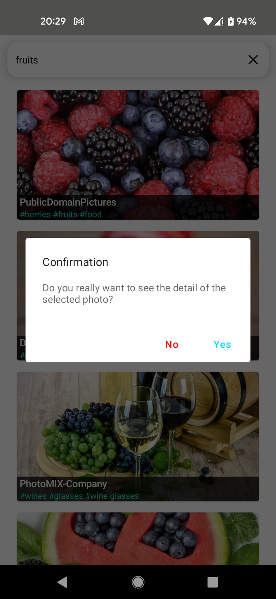

# Implementation documentation

In this code base, I implemented single activity, compose only, multi-module solution for searching photos in Pixabay API. 
I implemented the solution using multi-modular approach for better scalability.
The above dependency graph is showing which module are depending on which module. Core modules are not depending on any other 
module. Any feature module can depend on feature-shared modules and core modules. The feature-shared module can depend on
core modules. App module can depend on every other modules. The modularization is done depending on vertical slicing approach. 
For more information please check [this article](https://jeroenmols.com/blog/2019/03/18/modularizationarchitecture/).
This type of modularization makes the features loosely coupled, ensure high cohesion, no unintended behavior sharing and it is build time 
friendly.

## Architecture
To implement the solution, I used MVI+MVVM architecture with clean architecture
approach in each module. In MVI (Model, View, Intent) architecture, user interaction regards as event (or user intent)
that change the model which represents UI state. ViewModel is responsible for creating immutable state
for the ui and hold them. I use shared flow for user events, stateflow for states. User events are one time event that is why I use
hot observable like shared flow. Shared flow can be observed from multiple subscribers for this reason
it is a better option to use it for users event (if we want multiple work starting with one event). Stateflow is used 
for immutable view state which is collect as compose state in the screen. Stateflow can repeat last item whenever there is a new 
subscribe. That is why it is the best option for holding state and after the configuration change it can provide the 
last state. The error events are also part of the view state. Stateflow is also used for navigation. Channel are used for 
search keyword handling. For search keyword it was important that new search string can come continuously. Channel is better 
option for this. It is a hot stream which can be collected as cold flow. New items can be send to the channel and they can be
part of the collect flow. 

Inside every feature module, the packages representing clean code architecture layers (presentation, domain, data). 
The presentation layer is responsible for drawing UI, UI related logic and holding UI states. Composable screens, view model,  
UI data models and mappers are part of the presentation layer. Domain layer is responsible for business logic. Different business
use cases and domain models are implemented in this layer. Data layer is responsible for providing data. Repository 
implementation, datasource (internal and external) should be part of data layer. 

The following tools and technologies are used to implement the solution:

- kotlin
- Hilt
- Retrofit
- Kotlinx serialization
- Coroutines (flow)
- Jetpack Compose
- Room
- JUnit
- mockk
- turbine
- Espresso
- chucker
- detekt
- ktlint

## Screen shot

